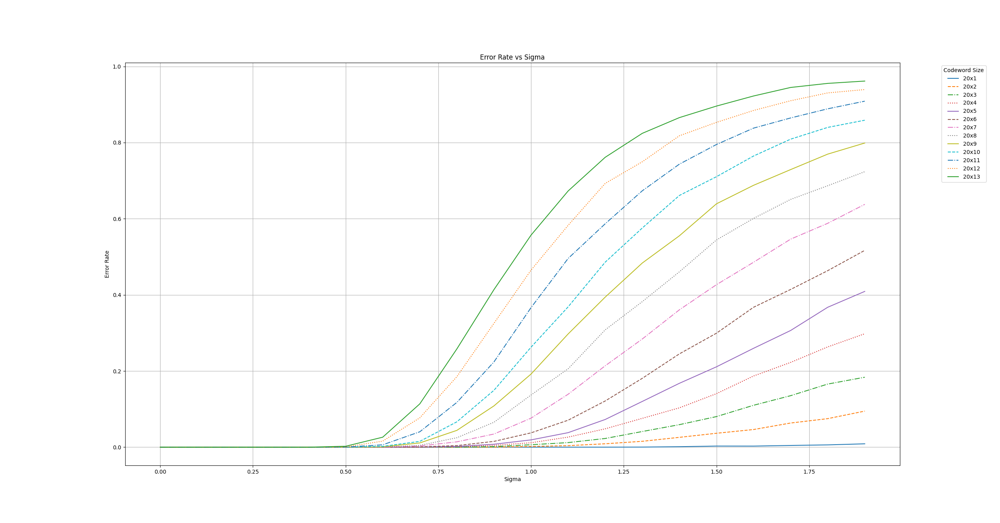

# Block Code Simulation and Visualization

## Overview

This project simulates the performance of a block code using a generator matrix and visualizes the error rates for different values of `k` (number of information bits) and `sigma` (standard deviation of the noise). While using classes may introduce some overhead and potentially slow down the execution, the decision was made to organize the code in this manner by personal desire

## Dependencies

### C++ Dependencies

1. **CMake**: For building the project.
2. **GCC**: C++ compiler.
3. **C++17 Support**: Ensure your compiler supports C++17.

### Python Dependencies

1. **Python 3**: For running the visualization script.
2. **Pandas**: For data manipulation.
3. **Matplotlib**: For plotting graphs.

## Installation

### C++ Dependencies

#### Installing CMake

- **Ubuntu/Debian**:
    ```bash
    sudo apt-get update
    sudo apt-get install cmake
    ```

#### Installing GCC

- **Ubuntu/Debian**:
    ```bash
    sudo apt-get update
    sudo apt-get install build-essential
    ```

### Python Dependencies

- **Installing Python 3**:
    - Download and install from [python.org](https://www.python.org/downloads/).
    - Alternatively, use a package manager like `apt`:
        ```bash
        sudo apt-get update
        sudo apt-get install python3 python3-pip
        ```

- **Installing Pandas and Matplotlib**:
    ```bash
    pip3 install pandas matplotlib
    ```

## Compilation

To compile the project, run the following script:

```bash
./compile.sh
```

This script will:
1. Check for the presence of CMake.
2. Create a `build` directory if it doesn't exist.
3. Generate build files using CMake.
4. Compile the project using `make`.

## Running Simulations and Visualization

To run the simulations and visualize the results, use the following script:

```bash
./run.sh <start_sigma> <end_sigma> <step_sigma> <num_simulations>
```

### Example

```bash
./run.sh 0.1 2.0 0.1 1000
```

This script will:
1. Check for the correct number of arguments.
2. Check for the presence of the compiled executable.
3. Run simulations with the provided parameters.
4. Check for Python 3 and required libraries.
5. Visualize results using `visualize.py` and save the plot as `combined_plot.png`.

## Usage

### Compilation Script (`compile.sh`)

1. **Check for CMake**.
2. **Create build directory**.
3. **Generate build files**.
4. **Compile the project**.

### Run Script (`run.sh`)

1. **Check for the correct number of arguments**.
2. **Check for the presence of the compiled executable**.
3. **Run simulations** with the provided parameters.
4. **Check for Python 3 and required libraries**.
5. **Visualize results** using `visualize.py`.

## Output

- **CSV Files**: Results for each `k` are saved in the `simulation_results` directory.
- **Plot**: A combined plot of error rates vs. sigma for different values of `k` is saved as `combined_plot.png` in the `simulation_results` directory.

  
  
  
